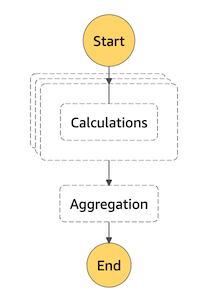
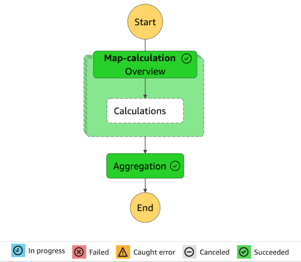
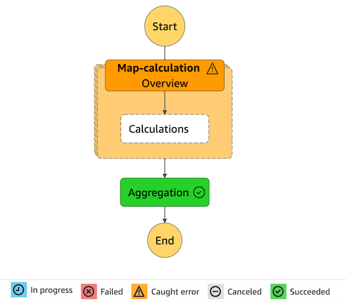

## AWS Step Function dynamic call Lambda functions -- Terraform

### State machine


### Test message
Send message to SQS queue
```json
{
    "items": [
        {
            "id": 100,
            "sleep": 2
        },
        {
            "id": 101,
            "sleep": 20
        },
        {
            "id": 103,
            "sleep": 10
        }
    ]
}
```

### Execution
Success


Set `"id": 104` when send SQS message to cause one Calculation Lambda failure

